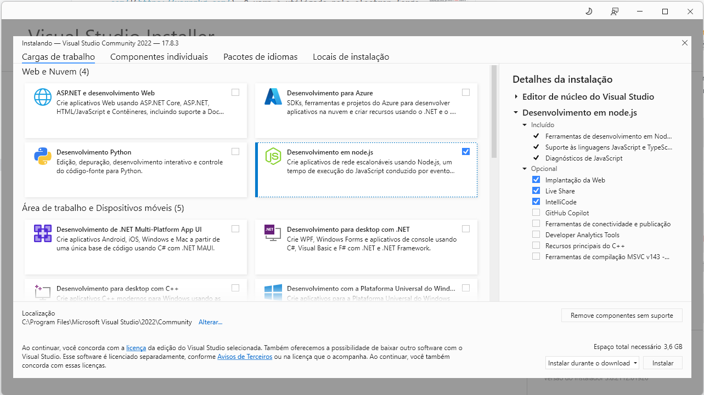

# SETE
<a href="#">

</a>


[](https://ci.appveyor.com/project/marcosroriz/seteweb)


O Sistema Eletrônico de Gestão do Transporte Escolar (SETE) é um software de _e-governança_ desenvolvido pelo [CECATE UFG](https://transportes.fct.ufg.br/p/31447-apresentacao-do-cecate-ufg) voltado a auxiliar na gestão do transporte escolar dos municípios brasileiros considerados suas singularidades.  O sistema foi projeto com intuito de não depender de nenhum software proprietário, desta forma é possível utilizá-lo sem ter de licenciar programas dependentes.


## Construindo (*building*) o SETE

O SETE é construído em cima do *framework*  [Electron](https://github.com/electron/electron), um arcabouço para codificação de aplicações desktop modernas baseado no ecosistema Node.js. 

O SETE utiliza bibliotecas nativas, a saber o SQLite, para possibilitar o uso de banco de dados espaciais de forma *offline*. 

Considerando estes fatores, para construir o **SETE** assume-se as seguintes dependências básicas:
* Node.js v18 LTS (*e.g.*, Node.js v18.18.2)
* Yarn v1.22. (utilizado pelo electron para empacotar os binários)
* Python 3.5

Além disso, para gerar os binários do sistema, será necessários as seguintes dependências.
* Windows:
    * [Ferramentas de build do Visual Studio (Visual Studio Community 2022)](https://visualstudio.microsoft.com/pt-br/thank-you-downloading-visual-studio/?sku=Community&channel=Release&version=VS2022&source=VSLandingPage&cid=2030&passive=false) para compilar os pacotes nativos
    * [Wix Toolset v3](https://wixtoolset.org/docs/v3/releases/v3-14-0-6526/) para gerar binários .msi e .exe para o Windows
* GNU/Linux:
    * Pacotes `fakeroot`, `dpkg` e `rpm` para gerar os binários para GNU/Linux
* Mac:
    * pacote `dmg-license` (`npm install dmg-license`)
    * pacote `appdmg` (`npm install appdmg`)


Para compilar o código execute os seguintes passos.

### 1: Instalação das dependências básicas
Instale o NodeJS v18. Você pode utilizar os binários disponbilizados no site [nodejs.org](nodejs.org) ou utilizar uma ferramenta de versionamento para instalação (_e.g._, [Node Version Manager - NVM](https://github.com/nvm-sh/nvm)).

Semelhantemente, instale o gerenciador de pacotes Yarn v1.22. Você pode utilizar os binários disponiblizados no site [https://yarnpkg.com/](https://yarnpkg.com/). O yarn é utilizado pelo electron-forge para gerar os binários.

#### 1.1 Microsoft Windows
Caso queira compilar para o Windows, instale o [Wix Toolset 3.14](https://wixtoolset.org/docs/v3/releases/v3-14-0-6526/) e coloque o diretório `bin` do mesmo na variável PATH. Por exemplo, adicionando `C:\Program Files (x86)\WiX Toolset v3.14\bin` a variável de ambiente PATH.

No caso da plataforma Windows, ainda é necessário instalar as [Ferramentas de build do Visual Studio (Visual Studio Community 2022)](https://visualstudio.microsoft.com/pt-br/thank-you-downloading-visual-studio/?sku=Community&channel=Release&version=VS2022&source=VSLandingPage&cid=2030&passive=false) para compilar os pacotes nativos. Ao instalar a ferramenta, é necessário marcar a caixa **Desenvolvimento em nodejs** para que o compilador consiga gerar módulos para o electron (veja a Figura abaixo).


Por fim, o Windows ainda requer que o `npm` especifique a versão do compilador do Visual Studio, por exemplo, 2022, e o caminho do binário do Python. Por exemplo, os comando abaixos especificam a versão 2022 e um caminho do Python (modifique para ser condizente com sua máquina). 

```sh
npm install -g npm@^8
npm config set msvs_version "2017"
npm config set python "C:\\Python35-x64\\pythonw.exe"
```

#### 1.2 GNU/Linux

Caso queira compilar para GNU/Linux, instale os pacotes `fakeroot`, `dpkg` e `rpm`. 
Por exemplo, no Ubuntu 18.04, você deve executar o seguinte comando:
```sh
sudo apt-get install fakeroot dpkg rpm
```

### 2: Baixe o código fonte

```sh
git clone https://github.com/SETE-FNDE/seteWeb/
```

### 3: Instale as dependências do Node
Depois instale as dependência:

```sh
npm install
```

### 4: Executando o projeto

Para executar o projeto basta utilizar o seguinte comando:
```sh
npm run start
```

### 5: Geração de Binários

#### 5.1 Windows
Antes de gerar os binários no Windows, é necessário editar o arquivo `package.json`, especificamente as linhas 38, 44 e 45.

É necessário indicar o PATH completo até as imagens que serão embutidas no instalador.
Especificamente, é necessário alterar o caminho `"C:\\projects\\seteWeb` para o diretório da sua máquina. Note que é necessário usar duas vezes o caractere barra invertida (`\\`) para representar o diretório na plataforma Windows.

**Linha 38** (altere `"C:\\projects\\seteWeb` para o caminho real na sua máquina):
```js
"iconPath": "C:\\projects\\seteWeb\\src\\renderer\\img\\icones\\setelogo.ico",
```
**Linha 44** (altere `"C:\\projects\\seteWeb` para o caminho real na sua máquina):
```js
"background": "C:\\projects\\seteWeb\\src\\renderer\\img\\installer-bg.jpg"
```
**Linha 45** (altere `"C:\\projects\\seteWeb` para o caminho real na sua máquina):
```js
"banner": "C:\\projects\\seteWeb\\src\\renderer\\img\\top-bg.jpg"
```

#### 5.2 Mac:
No caso do Mac, é necessário instalar duas dependências adicionais para gerar os binários:
  * pacote `dmg-license` (`npm install dmg-license`)
  * pacote `appdmg` (`npm install appdmg`)

#### 5.3 Todos os sistemas:
A geração de binários é feita utilizando o utilitário `electron-forge`. Especificamente, para gerar os binários, que ficarão na pasta `out`, execute o seguinte comando:

```sh
npm run make
```
## Licença de Uso
O sistema é distribuído gratuitamente sob a licença de software livre [MIT](https://github.com/marcosroriz/sete/blob/master/LICENSE) que possibilita o compartilhamento e modificação do código do mesmo por terceiros, por exemplo, por agências públicas, empresas e equipes tecnológicas dos municípios.
